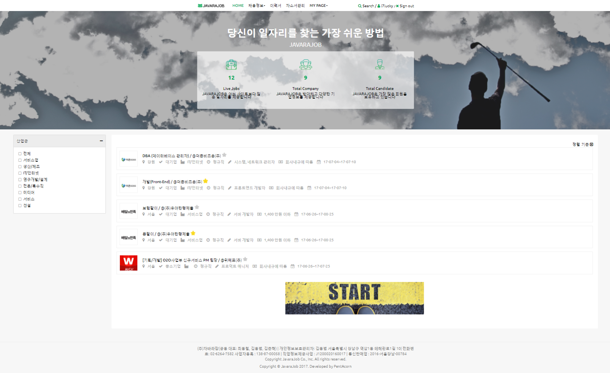
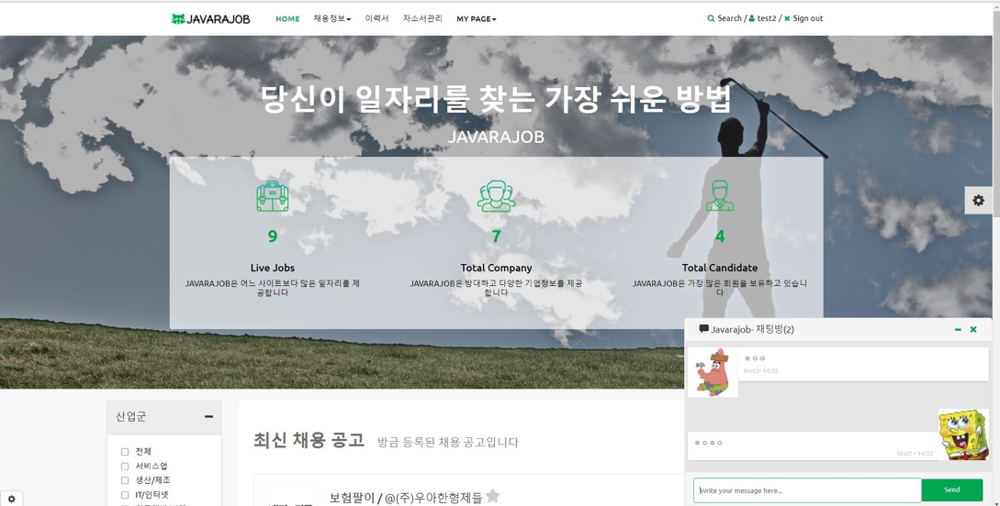
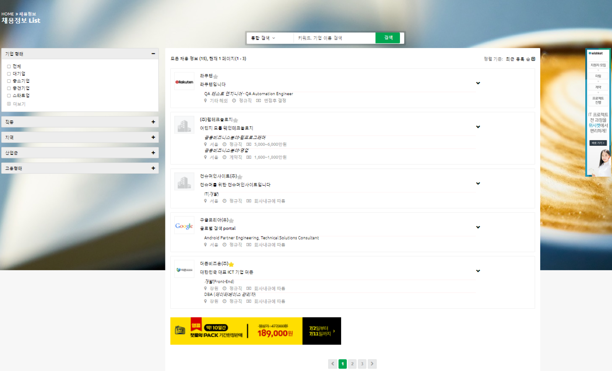
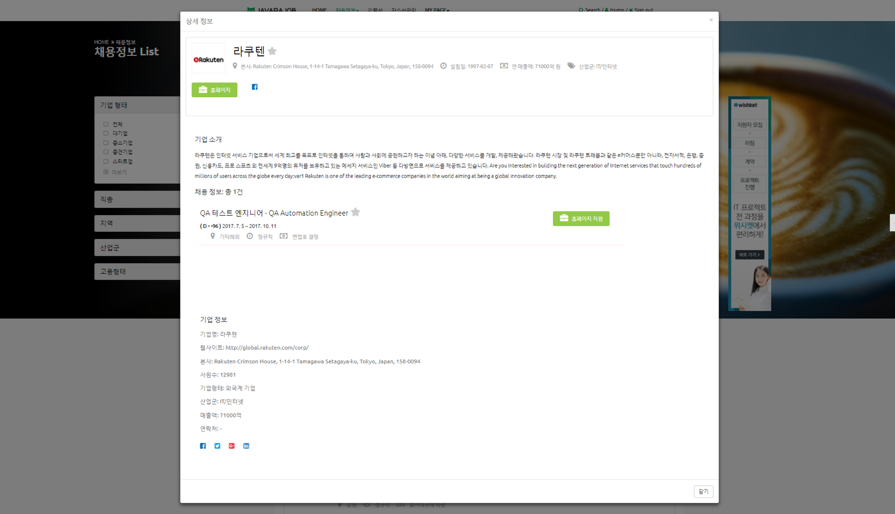
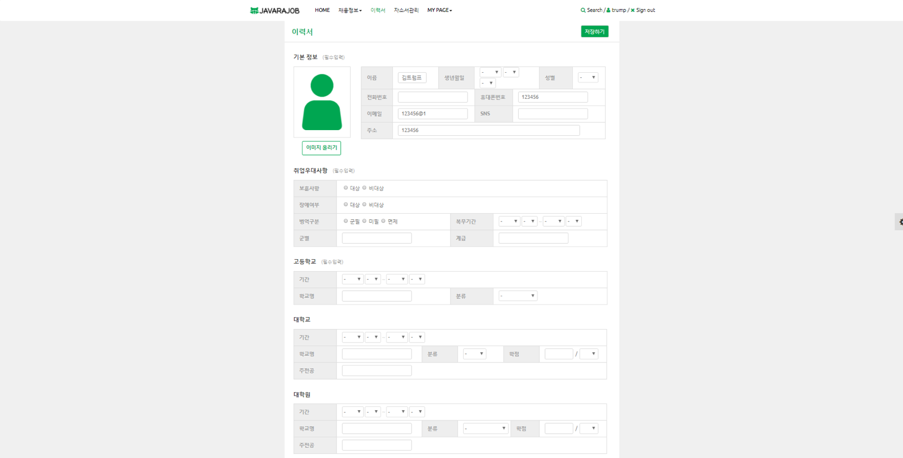
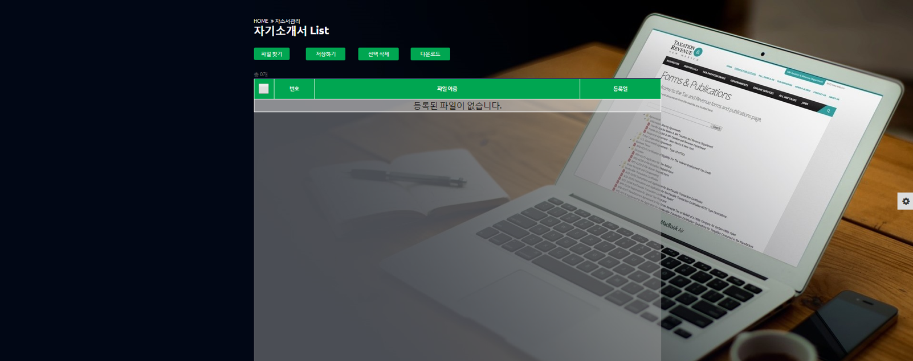
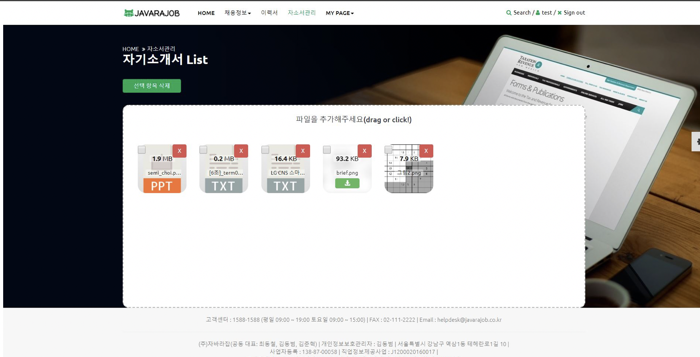
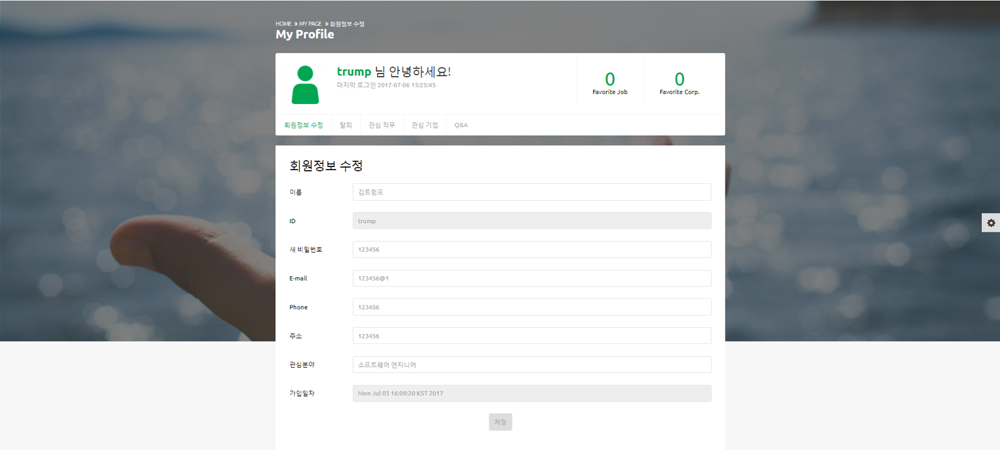
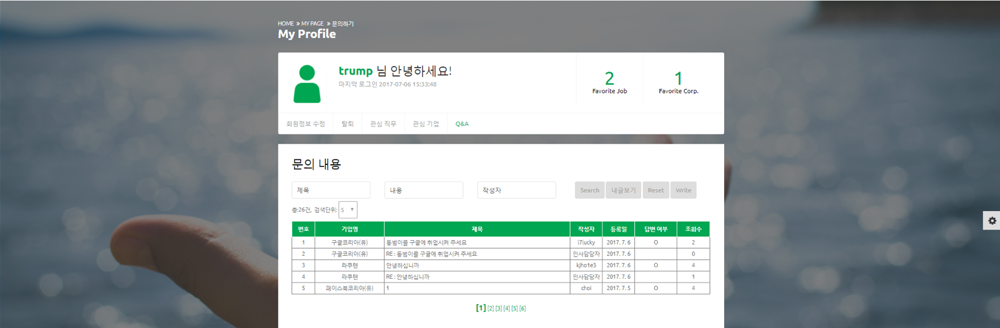

# JobSearchSite - JAVARAJOB
## Summary
>JobSearchSite which offers jobseekers searching positions from various perspectives using diverse filters, uploading and editing their resumes and files in the web site, chatting with other jobseekers, and having their own wishlists on calendar.  
>Companies also can upload their positions, have their own Q&A board, and give jobseekers answers and feedbacks from their HR directly.  
>Users can sign up, sign in/out, and edit/delete their accounts

## Skill Set
>Spring, MyBatis, JavaScript, JQuery, Ajax, Java, JSP, Bootstrap, and Oracle database

## Screenshots

